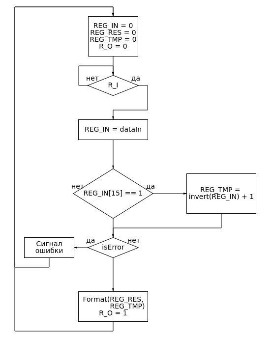

# Схема цифрового автомата
Исходя из алгоритма системной модели требуется сформировать
необходимый набор узлов. Подход к определению аппаратного состава может
быть следующим:

1. Введем регистр "REG\_IN" для хранения входного числа в дополнительном коде.
Разрядность регистра равна шестнадцати.
2. Для сохранения результата требуется ввести в схему регистр "REG\_RES", разрдность
которого равна шестнадцати.
3. Для промежуточных вычислений введем регистр "REG\_TMP" и регистр для
обозначения знака числа "REG\_SIGN".
4. Для корректного ввода данных автомат должен иметь возможность индетифицировать
момент, в который информация на входной шине сформирована. Именно с этой целью вводится
шина "R\_I". Автомат будет находиться в ожидании прихода сигнала на этой шине и лишь
после этого сможет сохранить введенное значение с шины "dataIn".
5. Аналогичная ситуация разворачивается и на выходе автомата. Выдадим сигнал на шину "R\_O"
длительностью в 1 такт, тогда как принимающее устройство будет вынуждено за этот такт
считать информацию.
6. Вследствие некорректности входных данных сформировать шину ошибки "REG\_ERROR"

В соответствии с описанным выше составом устройства будет составлена
блок-схема его функционирования.

## Блок-схема автомата

  

## Состояния автомата

1. Cброс будет соответствовать нулевому (начальному) состоянию.
2. В следующем (первом) состоянии автомату необходимо дождаться прихода сигнала
на шине "R\_I", записать значение с шины данных на регистр "REG\_IN", после чего
перейти на второе состояние.
3. Во втором состоянии необходимо проверить знак числа и в случае его отрицательности
перейти в третье состояние, иначе продолжить дальше и перейти в четвертое состояние.
4. В третьем состоянии необходимо перевести число в положительное число и поменять
значение "REG\_SIGN" на логическую единицу и затем перейти в четвертое состояние.
4. В четвертом состоянии необходимо проверить число на усечение и в случае истины 
перейти в пятое состояние ошибки, иначе перейти в шестое состояние.
5. В пятом состояние необходимо вывести шину ошибки и перейти в изначальное состояние.
6. В шестом состоянии необходимо перевести число в нужный формат и
сформировать результат, а затем перейти в изначальное состояние.
