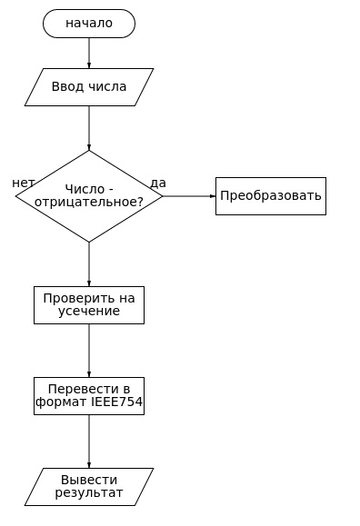

# Cистемная модель
## Дополнительный код числа
Числа, представленные в позиционной системе счисления, могут иметь
различные варианты кодирования. Одним из вариантов кодирования является
дополнительный код. Для лабораторной работы система счисления будет зафиксирована,
как двоичная. Отводя n разрядов на запись такого числа, диапазон чисел,
возможных для представления, будет представлен значениями от $-2^n + 1$ до $2^n - 1$
## Перевод в формат
При попытке перевести число в нужный формат необходимо предусмотреть следующие особенности выполненя
данной операции:
1. Отрицательное число, представленное в дополнительном коде, необходимо преобразовать и перевести в нужный формат.
2. Если число усекается, то выдается сообщение об ошибке.

## Алгоритм

На этом этапе требуется разработать алгоритм для решения поставленной задачи. Степень абстркации описания алгоритма должна быть адекватна поставленной на этапе задаче.

Для данной задачи алгоритм будет представлен ниже:

1. Ввести 16 бит числа в дополнительном коде в hex формате.
2. Преобразовать число, если оно отрицательное.
3. Проверить на усечение.
4. Перевести в формат IEEE754.
5. Вывести результат в hex формате.

## Блок-схема алгоритма

  

